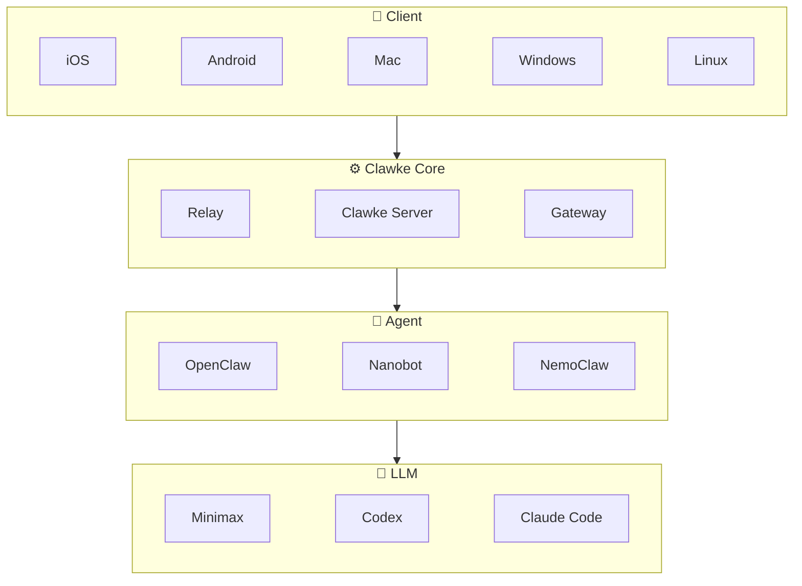

[English](README.md)
[中文文档](README_zh.md)

# Clawke

A secure, edge-cloud collaborative AI workspace. Clawke connects your local server to AI providers through the CUP (Clawke Unified Protocol) and delivers a rich native client experience via SDUI (Server-Driven UI).

[📱 iOS App](https://apps.apple.com/app/clawke/id6744313782) • 🖥 Mac App (coming soon) • 🤖 Android (coming soon) • [🔧 Build from Source](#build-from-source)

## Architecture



## Features

- **CUP Protocol** — Streaming AI responses with thinking blocks, tool calls, and usage tracking
- **SDUI** — Server-driven UI: dashboards, forms, dialogs rendered from server instructions
- **Multi-gateway** — Pluggable AI backends: [OpenClaw](https://github.com/nicepkg/openclaw) and [nanobot](https://github.com/swuecho/nanobot) supported
- **Media** — Image/PDF/text file upload and inline rendering
- **Relay** — Built-in tunnel for remote access without port forwarding

## Quick Start

### One-Click Install (Recommended)

```bash
curl -fsSL https://raw.githubusercontent.com/clawke/clawke/main/scripts/install.sh | bash
```

This will automatically install Node.js (if needed), clone the repo, build the server, and set up the global `clawke` command. After installation:

```bash
clawke gateway install     # Auto-detect and install AI gateway plugin
clawke server start        # Start Clawke Server
```

> **Windows users**: Install [WSL](https://learn.microsoft.com/windows/wsl/install) first (`wsl --install`), then run in WSL.

### Manual Install

Prerequisites: [Node.js](https://nodejs.org/) >= 18, [Flutter](https://flutter.dev/) >= 3.x (for client)

```bash
cd server
npm install                           # Installs dependencies + compiles TypeScript
npx clawke gateway install             # Auto-detect and install gateway plugin
npx clawke server start                # Start Clawke Server
```

The server will:

1. Copy config template to `~/.clawke/clawke.json` (first run)
2. Initialize SQLite database at `~/.clawke/data/clawke.db`
3. Start WebSocket server on port 8765 (client) and 8766 (upstream)
4. Start HTTP/media server on port 8781

### Build from Source

> iOS is available on the [App Store](https://apps.apple.com/app/clawke/id6744313782). Mac App Store and Google Play are coming soon.

```bash
cd client
flutter pub get
flutter run -d macos
```

> Replace `-d macos` with `-d ios`, `-d android`, `-d windows`, or `-d linux` for other platforms.

## Project Structure

```
clawke/
├── client/              # Flutter app (iOS, macOS, Android)
├── server/              # Clawke Server (TypeScript/Node.js)
│   ├── src/             # Source code
│   ├── config/          # Config templates
│   └── test/            # Tests (42 cases)
├── gateways/            # Gateway plugins
│   ├── openclaw/clawke/ # OpenClaw gateway
│   └── nanobot/clawke/  # nanobot gateway
└── relay-server/        # Relay server config
```

> 📖 For advanced configuration, see [CONFIGURATION.md](docs/CONFIGURATION.md).  
> 🔌 To build your own gateway, see [GATEWAY_INTEGRATION.md](docs/GATEWAY_INTEGRATION.md).

## Changelog

<!-- README_CHANGELOG_START -->
### v1.1.3 (2026-04-15)

**[New Feature]** Multi-session support with per-conversation AI configuration.  
**[New Feature]** Gateway selector for new conversations.  
**[Enhancement]** Complete internationalization (i18n) for all screens.  
**[Enhancement]** Desktop UI polish — unified AppBar styling and spacing.  
**[Bug Fix]** Fix cross-conversation message leakage.  
**[Bug Fix]** Fix port conflict detection on startup.  
**[Architecture]** Server-side conversation auto-creation.  
<!-- README_CHANGELOG_END -->

> [Full Changelog](docs/CHANGELOG.md)

## Contributing

1. Fork this repository
2. Create your feature branch (`git checkout -b feature/amazing-feature`)
3. Commit changes (`git commit -m 'Add amazing feature'`)
4. Push to branch (`git push origin feature/amazing-feature`)
5. Open a Pull Request

## License

[MIT](LICENSE)
