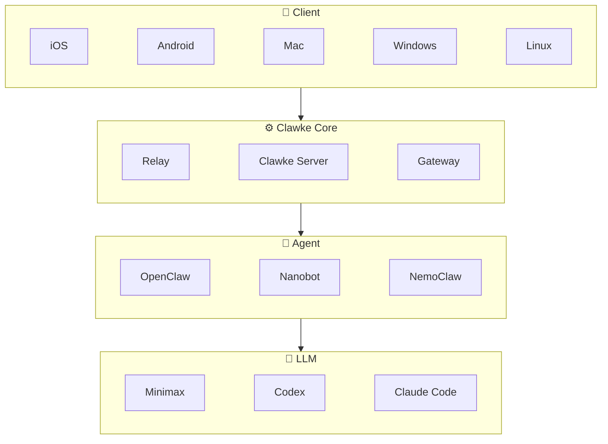

[English](README.md)
[中文文档](README_zh.md)

# Clawke

A secure, edge-cloud collaborative AI workspace. Clawke connects your local server to AI providers through the CUP (Clawke Unified Protocol) and delivers a rich native client experience via SDUI (Server-Driven UI).

[📱 iOS App](https://apps.apple.com/app/clawke/id6744313782) • 🖥 Mac App (coming soon) • 🤖 Android (coming soon) • [🔧 Build from Source](#build-from-source)

## Architecture



## Features

- **CUP Protocol** — Streaming AI responses with thinking blocks, tool calls, and usage tracking
- **SDUI** — Server-driven UI: dashboards, forms, dialogs rendered from server instructions
- **Multi-gateway** — Pluggable AI backends: [OpenClaw](https://github.com/nicepkg/openclaw) and [nanobot](https://github.com/swuecho/nanobot) supported
- **Media** — Image/PDF/text file upload and inline rendering
- **Relay** — Built-in tunnel for remote access without port forwarding

## Quick Install

```bash
curl -fsSL https://raw.githubusercontent.com/clawke/clawke/main/scripts/install.sh | bash
```

Works on macOS, Linux, and WSL2. The installer handles compiling the server, detecting your environment, and setting up the global CLI for you.

> **Windows:** Native Windows is not supported. Please install [WSL2](https://learn.microsoft.com/en-us/windows/wsl/install) and run the command above.

After installation:

```bash
source ~/.bashrc           # reload shell (or ~/.zshrc)
clawke gateway install     # Auto-detect and install AI gateway plugin
clawke server start        # Start Clawke Server
```

### Manual Install

Prerequisites: [Node.js](https://nodejs.org/) >= 18, [Flutter](https://flutter.dev/) >= 3.x (for client)

```bash
git clone https://github.com/clawke/clawke.git
cd clawke/server
npm install                           # Installs dependencies + compiles TypeScript
npx clawke gateway install             # Auto-detect and install gateway plugin
npx clawke server start                # Start Clawke Server
```

The server will:

1. Start WebSocket server on port 8765 (client) and 8766 (upstream)
2. Start HTTP/media server on port 8781

### Install Client

- **iOS**: Download from the [App Store](https://apps.apple.com/app/clawke/id6744313782).
- **Android**: Download from [Google Play](#) *(Coming soon)*.
- **macOS / Windows / Linux**: Download compiled binaries from the [Releases](https://github.com/clawke/clawke/releases) page.

Alternatively, you can build it yourself from source:

```bash
cd client
flutter pub get
flutter build macos  # Or: ios, apk, windows, linux
```

> To run in debug mode, use `flutter run -d macos` (replace `macos` with your target platform).

## Project Structure

```
clawke/
├── client/              # Flutter app (iOS, macOS, Android)
├── server/              # Clawke Server (TypeScript/Node.js)
│   ├── src/             # Source code
│   ├── config/          # Config templates
│   └── test/            # Tests (42 cases)
├── gateways/            # Gateway plugins
│   ├── openclaw/clawke/ # OpenClaw gateway
│   └── nanobot/clawke/  # nanobot gateway
└── relay-server/        # Relay server config
```

> 📖 For advanced configuration, see [CONFIGURATION.md](docs/CONFIGURATION.md).  
> 🔌 To build your own gateway, see [GATEWAY_INTEGRATION.md](docs/GATEWAY_INTEGRATION.md).

## Changelog

<!-- README_CHANGELOG_START -->
### v1.1.15 (2026-04-29)

**[New Feature]** Hermes gateway support.
**[New Feature]** Native Skills Center and task management pages.
**[Enhancement]** Gateway-backed model, skill, and translation refresh flows.
**[Bug Fix]** OpenClaw model routing and startup configuration fixes.
**[Architecture]** Expanded gateway and UI E2E regression coverage.

### v1.1.5 (2026-04-18)

**[New Feature]** One-click installation and unified CLI commands.  
**[New Feature]** AI typing status indicators.  
**[Enhancement]** Gateway pipeline optimizations.  
**[Bug Fix]** Comprehensive abort (stop generation) pipeline overhaul.  
**[Bug Fix]** Fixed concurrent message and delivery state issues.  

### v1.1.3 (2026-04-15)

**[New Feature]** Multi-session support with per-conversation AI configuration.  
**[New Feature]** Gateway selector for new conversations.  
**[Enhancement]** Complete internationalization (i18n) for all screens.  
**[Enhancement]** Desktop UI polish — unified AppBar styling and spacing.  
**[Bug Fix]** Fix cross-conversation message leakage.  
**[Bug Fix]** Fix port conflict detection on startup.  
**[Architecture]** Server-side conversation auto-creation.  
<!-- README_CHANGELOG_END -->

> [Full Changelog](docs/CHANGELOG.md)

## Contributing

1. Fork this repository
2. Create your feature branch (`git checkout -b feature/amazing-feature`)
3. Commit changes (`git commit -m 'Add amazing feature'`)
4. Push to branch (`git push origin feature/amazing-feature`)
5. Open a Pull Request

## License

[MIT](LICENSE)
