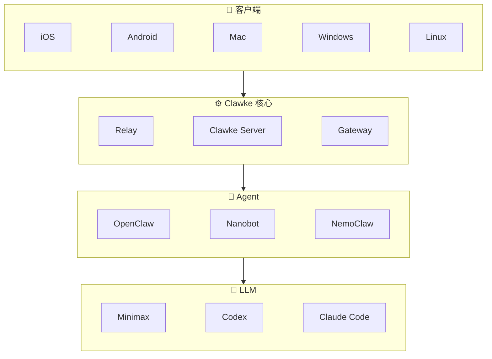

[English](README.md)
[中文文档](README_zh.md)

# Clawke

安全的边缘-云端协作 AI 工作空间。Clawke 通过 CUP 协议（Clawke Unified Protocol）连接本地服务器与 AI 提供商，并通过 SDUI（Server-Driven UI）提供丰富的原生客户端体验。

[📱 iOS App](https://apps.apple.com/app/clawke/id6744313782) • 🖥 Mac App（即将上线） • 🤖 Android（即将上线） • [🔧 从源码构建](#从源码构建)

## 架构



## 功能特性

- **CUP 协议** — AI 流式响应，支持思考块、工具调用和用量统计
- **SDUI** — 服务端驱动 UI：仪表盘、表单、对话框由服务端指令渲染
- **多网关** — 可插拔 AI 后端：已支持 [OpenClaw](https://github.com/nicepkg/openclaw) 和 [nanobot](https://github.com/swuecho/nanobot)
- **媒体** — 图片/PDF/文本文件上传与内联渲染
- **Relay** — 内置隧道，无需端口转发即可远程访问

## 快速开始

### 前置条件

- [Node.js](https://nodejs.org/) >= 18
- [Flutter](https://flutter.dev/) >= 3.x（客户端）

### 启动服务端

```bash
cd server
npm install                              # 安装依赖 + 编译 TypeScript
npx clawke openclaw-gateway install       # 安装 OpenClaw Gateway 插件
# 或: npx clawke nanobot-gateway install  # 安装 nanobot Gateway
npx clawke server start                   # 启动 Clawke 服务
```

服务端会：

1. 首次运行时将配置模板拷贝到 `~/.clawke/clawke.json`
2. 在 `~/.clawke/data/clawke.db` 初始化 SQLite 数据库
3. 启动 WebSocket 服务（8765 端口：客户端，8766 端口：上行）
4. 启动 HTTP/媒体服务（8781 端口）

### 从源码构建

> iOS 已上架 [App Store](https://apps.apple.com/app/clawke/id6744313782)。Mac App Store 和 Google Play 即将上线，敬请期待。

```bash
cd client
flutter pub get
flutter run -d macos
```

> 替换 `-d macos` 为 `-d ios`、`-d android`、`-d windows` 或 `-d linux` 以构建其他平台。

## 项目结构

```
clawke/
├── client/              # Flutter 客户端（iOS、macOS、Android）
├── server/              # Clawke 服务端（TypeScript/Node.js）
│   ├── src/             # 源码
│   ├── config/          # 配置模板
│   └── test/            # 测试（42 个用例）
├── gateways/            # Gateway 插件
│   ├── openclaw/clawke/ # OpenClaw Gateway
│   └── nanobot/clawke/  # nanobot Gateway
└── relay-server/        # Relay 服务配置
```

> 📖 高级配置请参阅 [CONFIGURATION_zh.md](docs/CONFIGURATION_zh.md)。  
> 🔌 自建网关接入请参阅 [GATEWAY_INTEGRATION.md](docs/GATEWAY_INTEGRATION.md)。

## 版本演进

<!-- README_CHANGELOG_START -->
### v1.1.3 (2026-04-15)

**[新功能]** 多会话管理：支持为每个会话独立配置 AI 网关和模型参数。  
**[新功能]** 新建会话时的 Gateway 选择器。  
**[功能优化]** 全面国际化（i18n）覆盖所有页面。  
**[功能优化]** 桌面端 UI 打磨 — 统一 AppBar 样式与间距。  
**[问题修复]** 修复跨会话消息泄漏。  
**[问题修复]** 修复启动时端口冲突检测。  
**[架构调整]** 会话自动创建移至服务端。  
<!-- README_CHANGELOG_END -->

> [完整版本记录](docs/CHANGELOG_zh.md)

## 贡献

1. Fork 本仓库
2. 创建特性分支 (`git checkout -b feature/amazing-feature`)
3. 提交更改 (`git commit -m 'Add amazing feature'`)
4. 推送分支 (`git push origin feature/amazing-feature`)
5. 创建 Pull Request

## 许可证

[MIT](LICENSE)
