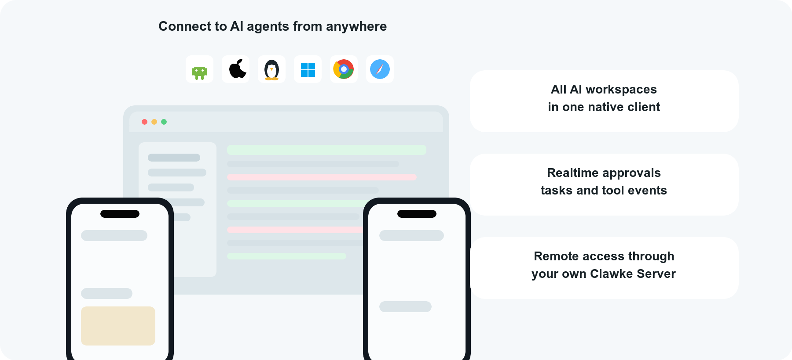

<p align="center">
  <a href="README.md">English</a>
  ·
  <strong>简体中文</strong>
</p>

<h1 align="center">
  
  <br />
  Clawke
</h1>

<h2 align="center">
AI Agent 原生移动工作空间
</h2>

<h4 align="center">
在手机或桌面端统一管理 OpenClaw、Hermes、Codex 和 Claude Code。
</h4>

<p align="center">
  🖥 <strong>Mac</strong>
  ·
  🪟 <strong>Windows</strong>
  ·
  🐧 <strong>Linux</strong>
  ·
  📱 <strong>iOS</strong>
  ·
  🤖 <strong>Android</strong>
</p>

<picture>
  <source media="(prefers-color-scheme: dark)" srcset=".github/readme-hero-dark.png">
  <source media="(prefers-color-scheme: light)" srcset=".github/readme-hero-light.png">
  
</picture>

## 功能特性

- **多端协同** — 同时支持 Mac、Windows、Linux、iOS、Android，无论走到哪里都可以继续工作
- **远程 Agent 工作空间** — OpenClaw、Hermes 可以运行在云服务器、Mac mini 或家用主机上，Clawke 客户端可在电脑和手机上远程连接、管理和操作
- **多 Agent 管理** — 可同时管理 OpenClaw、Hermes、Nanobot 等 AI Agent
- **媒体** — 图片/PDF/文本文件上传与内联渲染
- **Relay** — 内置隧道，无需端口转发即可远程访问

## 步骤 1：安装 Clawke Server

### 快速安装（推荐）

```bash
curl -fsSL https://raw.githubusercontent.com/clawke/clawke/main/scripts/install.sh | bash
```

支持 macOS、Linux 和 WSL2 环境。安装器会自动为您编译后端服务、探测系统环境并配置好全局 CLI 命令。

> **Windows:** 不支持原生 Windows，请安装 [WSL2](https://learn.microsoft.com/zh-cn/windows/wsl/install) 后再运行上述命令。

### 手动安装

前置条件：[Node.js](https://nodejs.org/) >= 18，[Flutter](https://flutter.dev/) >= 3.x（客户端）

```bash
git clone https://github.com/clawke/clawke.git
cd clawke/server
npm install                              # 安装依赖 + 编译 TypeScript
npx clawke gateway install                # 自动检测并安装 Gateway 插件
npx clawke server start                   # 启动 Clawke 服务
```

服务端会：

1. 启动 WebSocket 服务（8765 端口：客户端，8766 端口：上行）
2. 启动 HTTP/媒体服务（8781 端口）

### 常用命令

```bash
clawke --version          # 查看已安装的 Clawke 版本
clawke doctor             # 检查本机 Clawke 配置和运行状态
clawke update             # 更新 Clawke 到最新版本
clawke update --check     # 只检查更新，不安装
clawke gateway install    # 自动检测并安装 Gateway 插件
clawke gateway update     # 更新已配置的 Gateway 插件代码（不重启）
clawke server start       # 启动 Clawke 服务
clawke server stop        # 停止 Clawke 服务
clawke server restart     # 重启 Clawke 服务
clawke server status      # 查看 Clawke 服务状态
```

## 步骤 2：下载客户端

- **iOS**：请在 [App Store](https://apps.apple.com/us/app/clawke/id6760453431) 下载。
- **Android**：请直接到 [Releases](https://github.com/clawke/clawke/releases) 页面下载 APK 安装包。
- **macOS / Windows / Linux**：请前往 Github 的 [Releases](https://github.com/clawke/clawke/releases) 页面下载编译好的安装包。

如果您希望自己构建客户端：

```bash
cd client
flutter pub get
flutter build macos  # 也可以是 ios, apk, windows, linux
```

> 如果需要运行调试模式，请执行 `flutter run -d macos`（可将 `macos` 替换为其他平台）。

## 社区交流

有问题或想交流使用经验，可以扫码加入 Clawke 微信交流群讨论。

<p align="center">
  
</p>

## 项目结构

```
clawke/
├── client/              # Flutter 客户端（iOS、macOS、Android）
├── server/              # Clawke 服务端（TypeScript/Node.js）
│   ├── src/             # 源码
│   ├── config/          # 配置模板
│   └── test/            # 测试（42 个用例）
├── gateways/            # Gateway 插件
│   ├── openclaw/clawke/ # OpenClaw Gateway
│   └── hermes/clawke/   # Hermes Gateway
└── relay-server/        # Relay 服务配置
```

> 📖 高级配置请参阅 [CONFIGURATION_zh.md](docs/CONFIGURATION_zh.md)。  
> 🔌 自建网关接入请参阅 [GATEWAY_INTEGRATION.md](docs/GATEWAY_INTEGRATION.md)。

## 版本演进

<!-- README_CHANGELOG_START -->
### v1.1.31 (2026-05-12)

**[新功能]** 新增 Gateway 使用情况可视化、Gateway 更新自动重启和本地 Server 连接提示。
**[问题修复]** 修复 OpenClaw Gateway 配置合并，优化 GatewayClient 指引，并加固 Server PID 生命周期校验。

### v1.1.30 (2026-05-11)

**[问题修复]** 稳定 OpenClaw Gateway 集成和 UI E2E 回归校验。
**[功能优化]** 改进 Linux 桌面端注册、安装脚本兼容性、图标/字体 fallback 和 Gateway 安装指引。

### v1.1.29 (2026-05-10)

**[问题修复]** 修复 Mac App Store 构建中的 Apple/Google 登录、production APNs 和 App Store 托管更新行为。
**[功能优化]** 加固 Mac App Store 包上传前校验，并优化移动端 debug runtime 路径安全。

### v1.1.28 (2026-05-10)

**[问题修复]** 修复 GitHub release 构建中的 macOS Google 登录 keychain 访问问题。
**[功能优化]** 统一桌面端包入口名称，macOS、Windows、Linux 均对外使用 `Clawke`。

### v1.1.27 (2026-05-09)

**[问题修复]** macOS release 版保持原生 Google 登录，并隐藏当前 profile 尚不支持的 Apple 登录。
**[功能优化]** 优化桌面端 OAuth 打包，刷新桌面端图标，并将发布流程更新到当前 GitHub Actions runtime。

### v1.1.26 (2026-05-09)

**[问题修复]** 修复 macOS release 在 macOS 26 下的签名验证问题，并新增 Windows 桌面端浏览器 loopback Google OAuth。

### v1.1.23 (2026-05-09)

**[问题修复]** Windows 发布包随包携带 Visual C++ runtime，并隐藏不支持的桌面 Google 登录入口，确保官方 Windows 包能稳定启动。

### v1.1.22 (2026-05-09)

**[问题修复]** 恢复 Android release 签名并新增证书校验，防止 debug 签名 APK 导致 Google 登录失败。

### v1.1.21 (2026-05-03)

**[功能优化]** 稳定运行路径处理和任务 UI E2E 初始化流程，提升发布验证稳定性。
**[架构调整]** 将 upstream listener 边界统一命名为 gateway listener，并将内部规划文档移出公开文档。

### v1.1.20 (2026-05-02)

**[新功能]** 新增 Hermes cron 结果同步，支持持久化任务投递追踪和重试。
**[功能优化]** 优化任务管理投递状态、校验反馈和 Gateway 告警。
**[功能优化]** 优化 Hermes 媒体路由和会话级工作目录隔离。

### v1.1.17 (2026-04-29)

**[新功能]** 新增 `clawke doctor` 运行时与 Gateway 诊断命令。
**[功能优化]** 明确支持 OpenClaw、Hermes 等多 Agent 在线管理，并强调移动端随时管理能力。
**[问题修复]** 修复流式回复断线后 `Thinking`、工具状态和停止按钮残留的问题。

### v1.1.15 (2026-04-29)

**[新功能]** 新增 Hermes 网关支持。
**[新功能]** 原生技能中心与任务管理页面。
**[功能优化]** 基于网关的模型、技能与翻译刷新流程。
**[问题修复]** OpenClaw 模型路由与启动配置修复。
**[架构调整]** 扩展网关和 UI E2E 回归测试覆盖。

### v1.1.5 (2026-04-18)

**[新功能]** 一键安装脚本与统一的 CLI 管理命令。  
**[新功能]** AI 「正在输入」状态指示器。  
**[功能优化]** 网关底层通讯管道优化。  
**[问题修复]** 中止生成（Abort）全链路彻底修复。  
**[问题修复]** 并发消息与底层稳定性修复。  

### v1.1.3 (2026-04-15)

**[新功能]** 多会话管理：支持为每个会话独立配置 AI 网关和模型参数。  
**[新功能]** 新建会话时的 Gateway 选择器。  
**[功能优化]** 全面国际化（i18n）覆盖所有页面。  
**[功能优化]** 桌面端 UI 打磨 — 统一 AppBar 样式与间距。  
**[问题修复]** 修复跨会话消息泄漏。  
**[问题修复]** 修复启动时端口冲突检测。  
**[架构调整]** 会话自动创建移至服务端。  
<!-- README_CHANGELOG_END -->

> [完整版本记录](docs/CHANGELOG_zh.md)

## 贡献

1. Fork 本仓库
2. 创建特性分支 (`git checkout -b feature/amazing-feature`)
3. 提交更改 (`git commit -m 'Add amazing feature'`)
4. 推送分支 (`git push origin feature/amazing-feature`)
5. 创建 Pull Request

## 许可证

[MIT](LICENSE)
