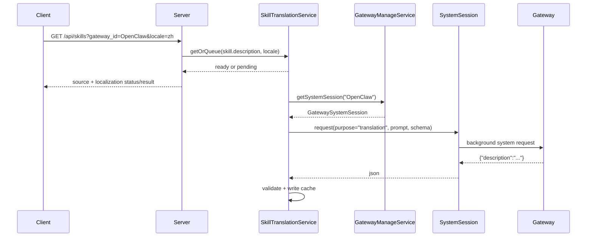

# Gateway System Session Translation Design

日期：2026-04-28

## 背景

现有 skill 翻译实现把翻译能力放在 Clawke Server 内部，通过 `CLAWKE_TRANSLATION_API_KEY || OPENAI_API_KEY` 直接调用 OpenAI-compatible API。这与产品边界不一致：

- Clawke Server 不应该为翻译单独持有另一套模型 API Key。
- 翻译应该使用当前 Gateway 自己的模型、provider 和运行时能力。
- 后台翻译不能污染用户聊天会话。
- 翻译能力应该是通用能力，不绑定 skill。skill description 只是第一个使用场景。

本设计修正 `2026-04-25-task-skill-cache-translation-design.md` 中“翻译 job 由 Server 执行，模型 API Key 只留在 Server”的执行方式。Server 仍负责任务排队、缓存和去重，但模型调用由对应 Gateway 的系统后台会话完成。

## 已确认决策

- 新增 `GatewayManageService`，职责只限于管理 Gateway 级系统后台会话。
- `GatewayManageService` 只暴露 `getSystemSession(gatewayId)`。
- 翻译业务不放进 `GatewayManageService`。
- 通用翻译能力放在业务层，例如 `TranslationService` 或现有 `SkillTranslationService` 的 translator 实现。
- 每个 Gateway 预留一个固定 system session，用于 Server 与 Gateway 的后台交互。
- system session 不属于用户会话，不进入用户聊天记录，不参与客户端 sync。
- skill 翻译只翻译 `description`，不翻译 `name`、`trigger`、`body`。
- 翻译结果继续走现有 cache/job 机制，避免重复翻译。

## 非目标

- 不新增 Client 侧模型调用。
- 不把翻译结果写入用户聊天消息。
- 不把 `GatewayManageService` 做成通用任务执行器。
- 不做单 Gateway 特例分支；现有 OpenClaw、Hermes、nanobot 都走同一 system session 协议。
- 不翻译 skill `name`、`trigger`、`body`。
- 不做翻译完成后的实时 push；仍依赖下一次 refresh/sync 获取 ready 翻译。

## 核心设计

### 服务边界

```text
GatewayManageService
  -> getSystemSession(gatewayId): GatewaySystemSession

GatewaySession
  -> GatewaySystemSession
  -> GatewayUserSession

SkillTranslationService
  -> 负责 skill description 翻译缓存、排队、sourceHash、结果写入
  -> 通过 GatewayManageService 获取 system session
  -> 自己构造 translation prompt 和 response schema
```

`GatewayManageService` 不理解翻译、摘要、模型探测等业务。它只负责取得对应 Gateway 的后台系统会话入口。

业务层拿到 `GatewaySystemSession` 后，自行包装具体功能：

- `SkillTranslationService` 包装为 description 翻译。
- 未来 `TitleGenerationService` 可以包装为标题生成。
- 未来 `GatewayProbeService` 可以包装为模型/技能探测。

### 推荐接口

```ts
interface GatewayManageService {
  getSystemSession(gatewayId: string): GatewaySystemSession;
}

interface GatewaySession {
  gatewayId: string;
  sessionId: string;
  kind: 'system' | 'user';
  request(input: GatewaySessionRequest): Promise<GatewaySessionResponse>;
}

interface GatewaySystemSession extends GatewaySession {
  kind: 'system';
  request(input: GatewaySystemSessionRequest): Promise<GatewaySystemSessionResponse>;
}

interface GatewayUserSession extends GatewaySession {
  kind: 'user';
  conversationId: string;
  request(input: GatewayUserSessionRequest): Promise<GatewayUserSessionResponse>;
}

interface GatewaySessionRequest {
  purpose: string;
  prompt: string;
  responseSchema?: Record<string, unknown>;
  timeoutMs?: number;
  metadata?: Record<string, unknown>;
}

interface GatewaySystemSessionRequest extends GatewaySessionRequest {
  internal: true;
}

interface GatewayUserSessionRequest extends GatewaySessionRequest {
  conversationId: string;
}

interface GatewaySessionResponse {
  ok: boolean;
  text?: string;
  json?: unknown;
  errorCode?: string;
  errorMessage?: string;
}

interface GatewaySystemSessionResponse extends GatewaySessionResponse {}

interface GatewayUserSessionResponse extends GatewaySessionResponse {}
```

`purpose` 只用于日志、限流和排查，不决定业务逻辑。翻译业务仍由调用方负责。

`request()` 是 request-response 模式。它返回 `Promise` 是因为 Server 到 Gateway、Gateway 到模型都是异步 I/O；调用方必须 `await` 结果后再解析 JSON、写缓存或标记失败。它不是 fire-and-forget 后台投递。

`metadata` 只用于追踪、审计、日志和排查，不参与业务执行，不应该原样进入 LLM prompt。协议层不固定 skill 字段；如果调用方是 skill 翻译，由调用方用通用字段标记来源，例如 `entity_type: "skill"` 和 `entity_id: "<skill id>"`。

`GatewaySystemSession` 和 `GatewayUserSession` 共用 `GatewaySession` 协议骨架，但副作用完全不同：system session 是后台内部交互，不写用户消息、不 sync、不通知；user session 面向真实用户会话，可以进入聊天记录和客户端同步。

当前阶段只实现 `GatewayManageService.getSystemSession(gatewayId)`。`GatewayUserSession` 先作为协议方向保留，后续需要统一用户会话 gateway 入口时再实现。

## System Session 规则

### Session ID

每个 Gateway 固定一个后台系统会话：

```text
__clawke_system__:<gatewayId>
```

示例：

```text
__clawke_system__:OpenClaw
__clawke_system__:Hermes
```

### 隔离要求

- system session 不能复用任何用户 `conversation_id`。
- system session 请求不能写入 `message_store`。
- system session 响应不能投递到 Client。
- system session 不能触发用户消息未读、通知、sync、聊天列表预览。
- Gateway 侧如有自身历史记录，也必须放入独立 system session，不混入真实用户对话。

### 上下文策略

默认不依赖 system session 的长上下文。固定 session ID 用于隔离身份和网关侧路由，不代表要累计上下文。

每次后台请求都应该携带完整 prompt 和结构化返回要求，避免不同后台任务互相污染。

## 翻译链路



## 翻译 Prompt 约束

业务层构造 prompt。skill description 翻译的最低要求：

```text
Translate the following skill description to zh.
Return strict JSON only.
Do not translate skill names, CLI names, file extensions, product names, or code terms.
Return exactly:
{"description":"..."}

Source:
<description>
```

返回必须经过 schema 校验：

- 必须是 JSON object。
- 必须包含非空 `description` string。
- 不允许把自由文本直接当翻译结果。
- 解析失败标记 job failed，或做一次 repair retry。

## Gateway 协议建议

Server 到 Gateway 可以新增通用后台请求类型：

```json
{
  "type": "gateway_system_request",
  "gateway_id": "OpenClaw",
  "system_session_id": "__clawke_system__:OpenClaw",
  "purpose": "translation",
  "prompt": "Return strict JSON...",
  "response_schema": {
    "type": "object",
    "required": ["description"],
    "properties": {
      "description": { "type": "string" }
    }
  },
  "metadata": {
    "source": "translation",
    "entity_type": "skill",
    "entity_id": "openclaw-bundled/1password",
    "locale": "zh"
  }
}
```

上面 `metadata` 是调用方附带的通用追踪信息。`translation` 本身不理解 skill；`SkillTranslationService` 只是作为调用方把 `entity_type/entity_id` 写进 metadata，方便日志和缓存任务排查。

Gateway 返回：

```json
{
  "type": "gateway_system_response",
  "ok": true,
  "json": {
    "description": "..."
  }
}
```

错误返回：

```json
{
  "type": "gateway_system_response",
  "ok": false,
  "error_code": "capability_not_supported",
  "error_message": "Gateway does not support system session requests."
}
```

## 与现有翻译缓存的关系

保留现有表和状态：

- `skill_translation_cache`
- `skill_translation_jobs`
- `missing`
- `pending`
- `running`
- `ready`
- `failed`

需要替换的是 translator backend：

```text
旧：
SkillTranslationService
  -> createConfiguredSkillTranslator()
  -> OpenAI-compatible API

新：
SkillTranslationService
  -> GatewaySystemTranslator
  -> GatewayManageService.getSystemSession(gatewayId)
  -> Gateway system request
```

`SkillTranslationService` 仍负责：

- 计算 `sourceHash`。
- 查 ready cache。
- 创建 job。
- 执行 job。
- 校验翻译结果。
- 写入 cache。

## Gateway 支持矩阵

第一版所有现有 Gateway 都必须接入同一 system session 协议。这样 Server 不需要按 Gateway 类型写跳过逻辑，也不需要保留当前 OpenAI translator 作为生产 fallback。

| Gateway | system session | translation | 行为 |
| --- | --- | --- | --- |
| OpenClaw | 必须实现 | 必须实现 | 使用 OpenClaw 当前模型/provider 翻译 |
| Hermes | 必须实现 | 必须实现 | 使用 Hermes 当前模型/provider 翻译 |
| nanobot | 必须实现 | 必须实现 | 使用 nanobot 当前模型/provider 翻译 |

Gateway 请求失败、超时或返回 invalid JSON 时，Server 不应该回退到自己的 OpenAI key，只标记对应 job failed 并让 UI fallback 原文。fallback 是异常兜底，不是某个 Gateway 的正常能力路径。

## 日志要求

日志必须能看出后台任务来源，但不能泄露 prompt 全文或模型密钥。

建议日志：

```text
[GatewayManage] system session resolved gateway=OpenClaw session=__clawke_system__:OpenClaw
[GatewaySystem] request purpose=translation gateway=OpenClaw timeoutMs=30000
[GatewaySystem] response ok purpose=translation gateway=OpenClaw durationMs=1234
[SkillTranslation] ready gateway=OpenClaw skill=openclaw-bundled/1password locale=zh
```

失败日志：

```text
[GatewaySystem] response failed purpose=translation gateway=OpenClaw code=capability_not_supported
[SkillTranslation] failed gateway=OpenClaw skill=openclaw-bundled/1password locale=zh error=invalid_json
```

## 测试要求

### Server 单元测试

- `GatewayManageService.getSystemSession(gatewayId)` 返回固定 system session。
- 同一 gateway 多次获取返回同一 session ID。
- 不同 gateway 返回不同 session ID。
- `SkillTranslationService` 使用 gateway system session translator，而不是 OpenAI env translator。
- Gateway 返回 invalid JSON 时 job 标记 failed。
- Gateway 请求失败、超时或返回 invalid JSON 时，job 标记 failed，UI fallback 原文。

### Gateway 测试

- system request 不进入普通用户消息分发。
- system request 不投递 channel outbound message。
- system request 使用独立 session ID。
- translation prompt 返回严格 JSON。

### 集成验证

- 清空某个 skill translation cache 后刷新技能页。
- 第一次返回 `pending`，显示原文。
- 后台 job 通过 Gateway system session 完成。
- 下一次刷新返回 `ready`，显示中文 description。
- 用户聊天列表和聊天记录中不出现任何翻译请求或翻译响应。

## 迁移步骤

1. 新增 `GatewayManageService` 和 `GatewaySystemSession` 接口。
2. 新增 Server 到 Gateway 的 `gateway_system_request/response` 协议。
3. OpenClaw、Hermes、nanobot Gateway 都实现 system session 请求处理。
4. 新增 `GatewaySystemTranslator`，替换 `createConfiguredSkillTranslator()` 注入。
5. 保留旧 OpenAI translator 仅作为测试 mock 或删除，不能作为生产 fallback。
6. 更新 skill translation tests，断言不依赖 `OPENAI_API_KEY`。
7. 远端部署后清理 failed/pending translation jobs，让后台重新排队。

## 验收标准

- 远端未配置 `OPENAI_API_KEY` 或 `CLAWKE_TRANSLATION_API_KEY` 时，skill description 仍可通过 OpenClaw Gateway 翻译。
- Hermes 和 nanobot 也不依赖 Server 侧 `OPENAI_API_KEY` 或 `CLAWKE_TRANSLATION_API_KEY`，统一通过各自 Gateway system session 翻译。
- 翻译请求不出现在任何用户会话消息历史中。
- `GatewayManageService` 只有 `getSystemSession(gatewayId)` 一个公开职责。
- `SkillTranslationService` 继续负责 skill 翻译缓存和状态，不把业务逻辑塞进 `GatewayManageService`。
- Gateway 请求失败、超时或 invalid JSON 时能稳定 fallback 原文，不影响技能管理页面使用。
