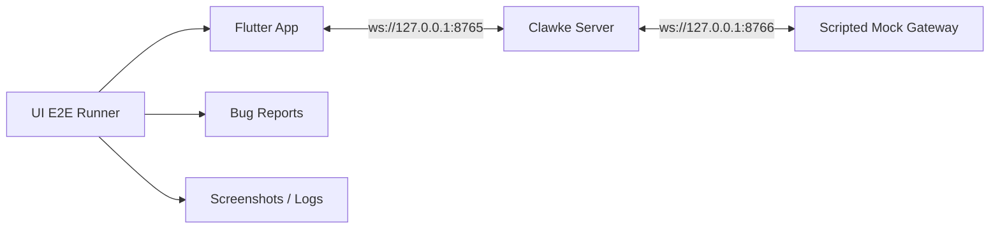
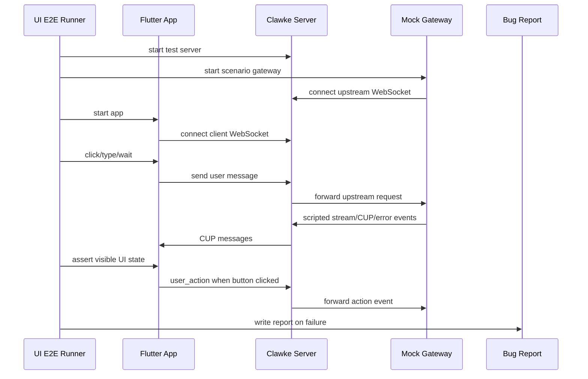

# UI E2E 集成测试系统设计

日期：2026-04-25

## 结论

Clawke 的主干质量保障以 **Mock Gateway UI E2E** 为核心：测试从真实 Flutter UI 入口发起，串联真实 Clawke Server、真实 WebSocket、真实 CUP 解析和真实 Flutter 原生渲染。唯一稳定 mock 的外部边界是 Gateway。

测试系统定位为 QA agent：只负责执行用例、观察 UI、采集日志和提交 bug report，不自动修复。



## 已确认决策

- 第一阶段手动触发，不接 CI。
- 主力测试层使用 Mock Gateway UI E2E，覆盖尽量全面的人工主干路径。
- UI 定位采用“用户语义优先 + 少量 `Semantics.identifier` 兜底”，详见 `locator-strategy.md`。
- 不做 Mock Agent Full E2E；成本高，收益不如真实 Agent smoke。
- Gateway 逻辑用 Gateway Contract Test 覆盖，不接真实 Agent/LLM。
- 真实 Agent/LLM 只做少量 smoke；后续可切本地模型降低成本。
- PRD 自动生成用例暂缓；先把手写主干用例跑通并沉淀。
- 失败只生成 bug report，不自动修复。

## 目标

- 把人工点击 UI 的主干路径固化为可重复执行的系统级用例。
- 每个用例从 UI 层操作开始，避免直接调用 Provider、DAO 或业务方法。
- 覆盖 Client、Server、WebSocket、CUP、状态流转、DB/test DB、UI 渲染和用户交互回传。
- 外部智能体行为完全脚本化，保证测试稳定、可断言、低成本。
- 每次运行输出清晰报告：通过、失败、截图、日志、复现步骤、关联 case。

## 非目标

- 不测试真实 LLM 回答质量。
- 不在第一阶段接 CI、pre-commit 或发布流水线。
- 不从 PRD 自动生成可执行测试。
- 不自动修复失败用例。
- 不把真实 Agent/LLM 放进高频主回归。

## 测试分层

### 1. Mock Gateway UI E2E

主力层。

```text
Flutter UI -> Clawke Server -> Mock Gateway
```

覆盖用户真实操作路径：

- 启动连接状态。
- 新建会话。
- 发送文本消息。
- 流式 AI 回复。
- CUP 组件渲染。
- 原生按钮点击与 `user_action` 回传。
- abort / reconnect / sync。
- 错误状态。
- 图片和文件主流程。

Mock Gateway 按用例脚本返回确定性的上游事件，不接真实 Agent，不接 LLM。

### 2. Gateway Contract Test

低成本验证真实 Gateway 转换逻辑。

```text
Mock upstream event -> Real Gateway adapter -> Expected CUP
```

它不启动 Flutter UI，不启动 Clawke Server，不连真实 Agent/LLM。目标是证明：只要上游结构化事件符合约定，Gateway 一定能输出标准 CUP。

覆盖：

- stream delta -> `text_delta`
- tool call -> tool card / trace component
- approval request -> action confirmation component
- error -> standardized error component
- metadata / usage -> normalized metadata

### 3. Local LLM Smoke

低成本真实链路验证。

```text
Flutter UI -> Clawke Server -> Real Gateway -> Real Agent -> Local LLM
```

只验证结构和连通性，不断言具体回答内容。

覆盖：

- 能连接。
- 能返回。
- 能流式。
- 工具/审批链路不崩。
- UI 不崩。

### 4. Remote/Production LLM Smoke

发布前少量确认，不作为日常主回归。

```text
Flutter UI -> Clawke Server -> Real Gateway -> Real Agent -> Remote LLM
```

覆盖 3-5 条最终可用性路径即可。

## Mock Gateway UI E2E 架构



### 组件

| 组件 | 职责 |
| --- | --- |
| `ui-e2e-runner` | 编排服务启动、App 启动、用例执行、报告输出 |
| `mock-gateway` | 连接 Server upstream 端口，按 scenario 返回确定性事件 |
| `case manifest` | 描述用户步骤、Mock Gateway 响应、UI 断言 |
| `artifact collector` | 收集截图、Server 日志、Client 日志、Mock Gateway 日志 |
| `bug reporter` | 失败时生成 markdown bug report |

## 目录结构

UI E2E 测试系统集中放在 `test/ui-e2e/`，形成独立测试包。

```text
test/ui-e2e/
  tools/          # runner、mock-gateway、启动脚本
  test-cases/     # 持久化用例 YAML/JSON
  docs/           # 设计说明、用例编写规范
  fixtures/       # 测试图片、文件、固定 CUP payload
  templates/      # bug report 模板
  runs/           # 运行产物，不提交
  bug-reports/    # 失败报告，不提交
```

Git 管理：

- `test/ui-e2e/tools/`
- `test/ui-e2e/test-cases/`
- `test/ui-e2e/docs/`
- `test/ui-e2e/fixtures/`
- `test/ui-e2e/templates/`

本地持久化但不提交：

- `test/ui-e2e/runs/`
- `test/ui-e2e/bug-reports/`

## 用例格式

用例必须持久化，不写阅后即焚脚本。建议放：

```text
test/ui-e2e/test-cases/
  p0-send-message.yml
  p0-code-editor-action.yml
  p0-reconnect.yml
```

示例：

```yaml
id: p0-code-editor-action
title: CodeEditor CUP renders and sends action
tags: [p0, cup, ui-action]

setup:
  server_mode: test
  gateway_scenario: code_editor

steps:
  - action: launch_app
  - action: wait_for_text
    text: "Clawke"
  - action: create_conversation
    name: "E2E Code Case"
  - action: send_message
    text: "给我一段代码"
  - action: wait_for_text
    text: "main.dart"
  - action: click_text
    text: "写入本地"

mock_gateway:
  on_user_message:
    contains: "给我一段代码"
    replies:
      - type: text_delta
        text: "好的，下面是代码："
      - type: ui_component
        widget_name: CodeEditorView
        props:
          language: dart
          filename: main.dart
          content: "void main() {}"
        actions:
          - action_id: cmd_apply_file
            label: 写入本地
            type: remote

assert:
  - ui_text_visible: "main.dart"
  - gateway_received_action: "cmd_apply_file"
```

## 第一版最小闭环

第一版只跑通一条完整主链路：

```text
启动 Server
-> 启动 Mock Gateway
-> 启动 Flutter App
-> 自动新建会话
-> 发送消息
-> Mock Gateway 返回流式回复
-> UI 断言回复可见
-> 失败生成 bug markdown
```

验收标准：

- 一条命令手动触发。
- 不依赖真实 Agent/LLM。
- 测试 DB 或隔离数据目录，不碰生产数据。
- 失败时有截图、日志、复现步骤。
- 成功时明确输出 passed case 列表。

第一条落地用例固定为 `test/ui-e2e/test-cases/p0-send-message.json`。

## 第一批 P0 用例

1. App 启动后连接 ready。
2. 新建会话成功。
3. 发送文本消息并收到流式回复。
4. CodeEditor CUP 渲染并点击按钮，Server/Mock Gateway 收到 `user_action`。
5. Gateway 断开后 UI 显示异常状态，恢复后可继续发送。

第二批再扩展：

- abort。
- sync。
- 错误卡片。
- 图片发送。
- 文件发送。
- 多会话隔离。
- 长回复滚动性能基础检查。

## Bug Report 格式

失败报告建议放：

```text
test/ui-e2e/bug-reports/
  2026-04-25-p0-send-message.md
```

模板：

```markdown
# UI E2E Bug: p0-send-message

## Summary

发送消息后没有看到流式回复。

## Case

- id: p0-send-message
- run_id: 2026-04-25T01-30-00
- branch: codex/ui-e2e-system

## Expected

UI 显示 Mock Gateway 返回的回复文本。

## Actual

聊天区没有出现回复文本，测试在 `wait_for_text` 超时。

## Repro Steps

1. 启动测试 runner。
2. 新建会话。
3. 发送 `你好 Clawke`。

## Artifacts

- screenshot: artifacts/p0-send-message/failure.png
- server_log: artifacts/p0-send-message/server.log
- client_log: artifacts/p0-send-message/client.log
- mock_gateway_log: artifacts/p0-send-message/mock-gateway.log
```

## 数据隔离

测试必须使用隔离数据：

- Server 使用测试 DB 或测试数据目录。
- Flutter 使用测试 profile / 临时应用数据目录。
- 严禁操作 `server/data/clawke.db` 生产数据库。
- 所有测试 artifacts 写入 `test/ui-e2e/runs/<run_id>/`。

## 执行方式

第一阶段手动触发：

```bash
./test/ui-e2e/tools/run.sh --case p0-send-message
./test/ui-e2e/tools/run.sh --suite p0
```

后续可扩展：

- `--headed`：显示真实窗口，方便调试。
- `--keep-artifacts`：成功用例也保留截图和日志。
- `--debug`：服务不自动退出，方便人工继续排查。

## 实施顺序

1. 建立 worktree 和设计文档。
2. 建立 runner 骨架，只支持手动触发。
3. 建立 scripted Mock Gateway。
4. 跑通 `p0-send-message`。
5. 加 bug report 和 artifacts。
6. 扩展 4 条 P0 用例。
7. 单独补 Gateway Contract Test。
8. 最后补 Local LLM Smoke。

## 风险

- UI 自动化选择器不稳定：需要为关键控件补稳定 key/semantics。
- Flutter App 启动慢：runner 需要明确超时和日志。
- 断线重连测试容易 flaky：先做最简单状态断言，再加复杂时序。
- 文件/图片测试依赖系统文件选择器：第一版可优先用可注入路径或测试入口，避免直接自动化 Finder。
- 真实 LLM smoke 不可稳定断言内容：只断言结构、状态和 UI 不崩。
